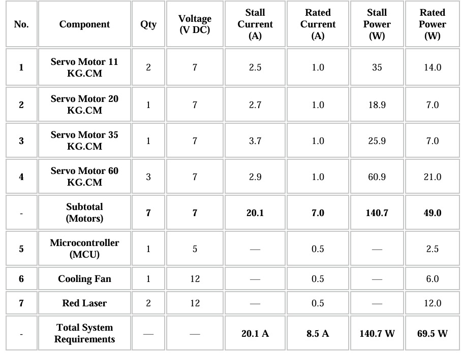
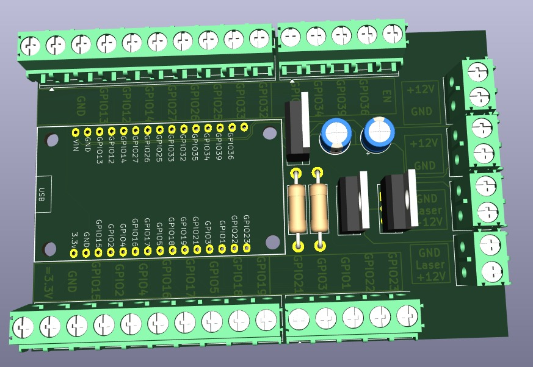
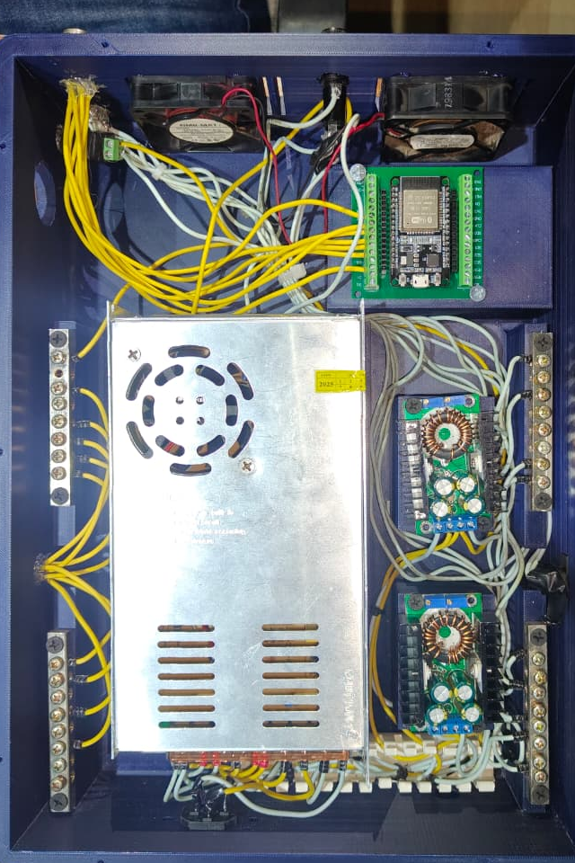
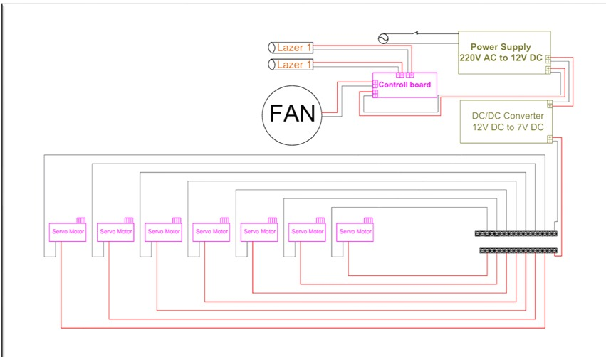

# 🔌 Hardware Module

<div align="center">

# Hardware Development

### 6-DOF Educational Robotic Arm Kit

The hardware module is responsible for controlling the physical robotic arm through embedded systems, electronic circuits, power management, and communication with the software platform.

</div>

---

# 📖 Overview

The Hardware Module provides the interface between the software platform and the physical robotic arm.

It controls all servo motors, manages power distribution, and enables real-time communication with the software application to execute robot movements accurately and safely.

The hardware system was designed to ensure reliability, smooth operation, and easy maintenance for educational purposes.

---



---

# 📂 Hardware Structure

```text
Hardware/
│
├── Circuit_Diagrams/
├── Wiring/
├── Power_System/
├── Components/
├── Datasheets/
└── Documentation/
```

---



---

# 🛠️ Hardware Components

| Component | Description |
|------------|-------------|
| ESP32 | Main Microcontroller |
| Servo Motors | Joint Motion Control |
| Power Supply | System Power Source |
| Servo Driver | Motor Signal Distribution |
| Connecting Wires | Electrical Connections |
| Robotic Arm | Mechanical Structure |

---

# 🔌 Electronic System

The electronic system consists of:

- ESP32 Microcontroller
- Servo Motor Connections
- Power Distribution
- Signal Wiring
- USB Communication

<div align="center">



*Figure 1. Electronic Circuit Diagram.*

</div>

---

# ⚡ Power Management

The power system provides stable voltage and current to all servo motors while protecting the controller from voltage fluctuations.

### Features

- Stable Power Distribution
- Overcurrent Protection
- Reliable Servo Operation
- Safe Electrical Connections

<div align="center">


---


</div>

---

# 🔗 Wiring Diagram

This section contains all wiring connections between:

- ESP32
- Servo Motors
- Power Supply
- Communication Interfaces

<div align="center">



</div>

---

# 📡 Communication

Communication between the software application and the robotic arm is established through serial communication.

### Communication Process

```text
GUI
   │
   ▼
Python Application
   │
   ▼
Serial Communication
   │
   ▼
ESP32
   │
   ▼
Servo Motors
   │
   ▼
Robot Motion
```

---

# 📁 ESP32 Firmware

The ESP32 firmware is responsible for:

- Reading commands
- Controlling servo motors
- Executing movement sequences
- Sending feedback to the software

---

# 📚 Documentation

The Documentation folder includes:

- Circuit Schematics
- Wiring Instructions
- Component Datasheets
- Hardware Manual
- Assembly Guide

---

# 🚀 Future Improvements

- Wireless Communication
- Sensor Integration
- Current Monitoring
- Battery Management System
---

# 👨‍💻 Hardware Team

| Member | Responsibility |
|---------|----------------|
| **Seif Allah Wael Hassan** | Software & Hardware Development |
| **Giovanni El-Amir Gaber** | Hardware Development |

---

<div align="center">

### 🔌 Hardware Module for the 6-DOF Educational Robotic Arm Kit

Designed for educational and research purposes.

</div>
