<div align="center">


# BENHA NATIONAL UNIVERSITY

### Faculty of Engineering

### Mechatronics and Automation Department

<br>

# 🎓 Graduation Project 2026

# 🤖 6_DOF Educational Robotic Arm Kit

### Learn • Visualize • Simulate • Understand Robotics

An interactive educational platform designed to help students understand robotic kinematics through real-time simulation, visualization, and control.

<br>


</div>

---

# 📖 Overview

Robotics education often focuses on mathematical equations and theoretical concepts without providing sufficient visualization of robot behavior.

The 6-DOF Educational Robotic Arm Kit was developed to bridge the gap between theoretical robotics concepts and practical implementation.

The platform provides an interactive environment where students can:

✅ Explore Forward Kinematics

✅ Explore Inverse Kinematics

✅ Generate Robot Trajectories

✅ Simulate Robot Motion

✅ Control a Physical Robot Arm

✅ Visualize Mathematical Concepts in Real Time

The system combines software simulation, educational visualization, and hardware integration to create a complete robotics learning experience.

---
## 🖼️ Project Preview

<div align="center">

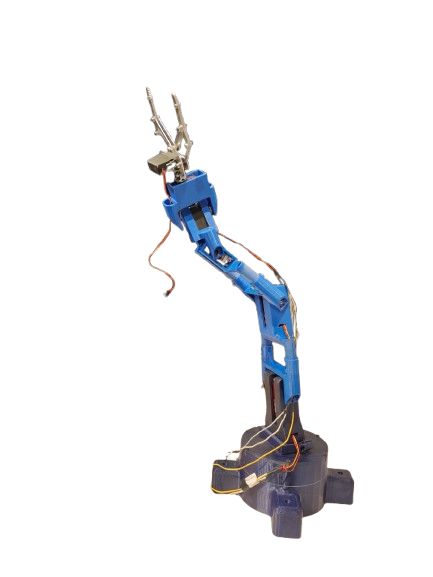

*Figure 1. Overview of the 6-DOF Educational Robotic Arm Kit.*

</div>

---

# ✨ Key Features

| Feature | Description |
|----------|-------------|
| Forward Kinematics | Calculate end-effector position and orientation |
| Inverse Kinematics | Generate joint angles for a desired pose |
| Path Planning | Generate smooth robot trajectories |
| Robot Simulation | Real-time simulation using PyBullet |
| GUI Interface | User-friendly educational interface |
| Data Visualization | Graphs and performance analysis |
| ESP32 Integration | Physical robot control |
| Educational Content | Learning-focused design |

---

# 🏗️ System Architecture

```text
User
 │
 ▼
GUI Interface (Tkinter)
 │
 ▼
Kinematics Engine
(FK / IK Calculations)
 │
 ▼
Control Module
 │
 ▼
Simulation Engine
(PyBullet)
 │
 ▼
6-DOF Robot Model
```

---

# 🔄 Forward Kinematics Workflow

```text
Start
 │
 ▼
Input Joint Angles
 │
 ▼
Apply DH Parameters
 │
 ▼
Compute Transformation Matrices
 │
 ▼
Calculate End-Effector Pose
 │
 ▼
Visualize Results
 │
 ▼
End
```

---

# 🔄 Inverse Kinematics Workflow

```text
Start
 │
 ▼
Input Desired Pose
 │
 ▼
Inverse Kinematics Solver
 │
 ▼
Generate Joint Angles
 │
 ▼
Validate Solution
 │
 ▼
Visualize Robot Motion
 │
 ▼
End
```

---

# 🔄 Path Planning Workflow

```text
Start
 │
 ▼
Select Start Position
 │
 ▼
Select Goal Position
 │
 ▼
Generate Trajectory
 │
 ▼
Interpolate Waypoints
 │
 ▼
Execute Motion
 │
 ▼
End
```

---

# 📸 Graphical User Interface (GUI)

## 🏠 Home Interface

| Main Window | Student Information |
|:-----------:|:-----------------:|
| 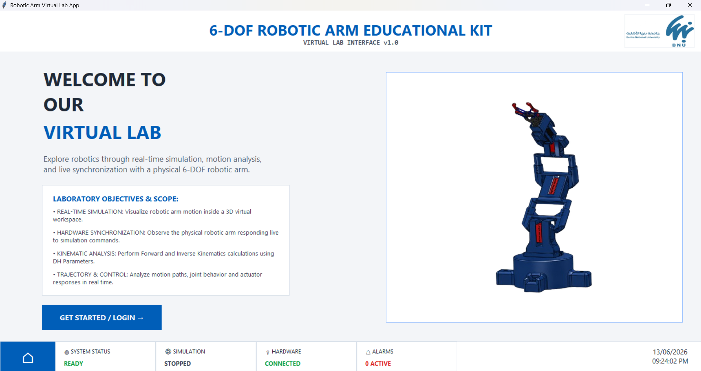 | 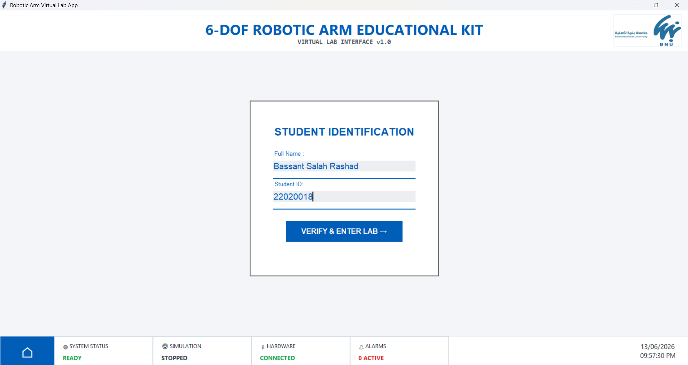 |

---

## ⚙️ Forward Kinematics

| Tutorial Videos | Simulation Result |
|:----------------:|:-----------------:|
|  | 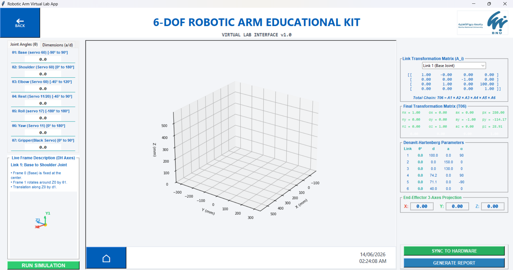 |

---

## 🎯 Inverse Kinematics

| Tutorial Videos | Calculated Motion |
|:----------:|:-----------------:|
| 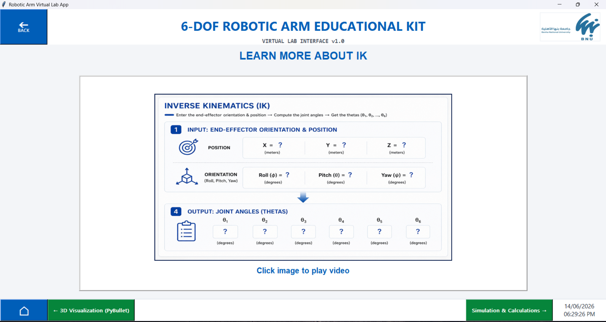 | 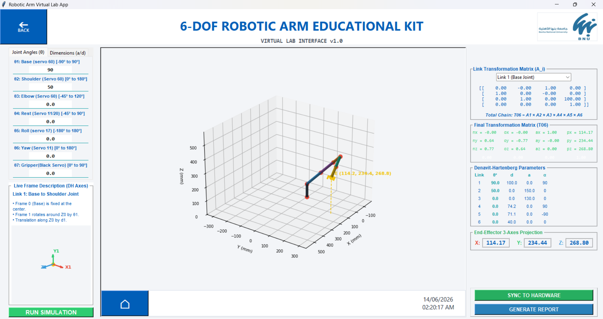 |

---

## 📈 Path Planning

| Tutorial Videos | Robot Movement |
|:---------------------:|:--------------:|
|  | 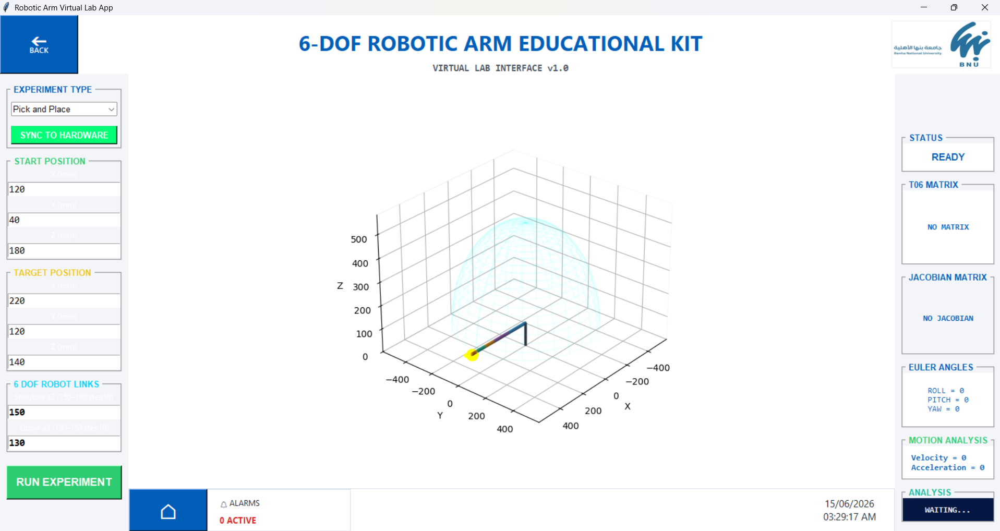 |

---

## 📈 Torque & Forces

| Tutorial Videos | Robot Movement |
|:---------------------:|:--------------:|
| 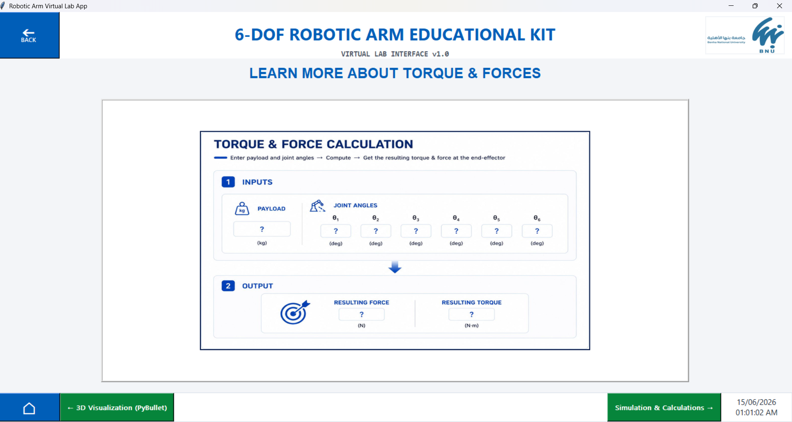 | 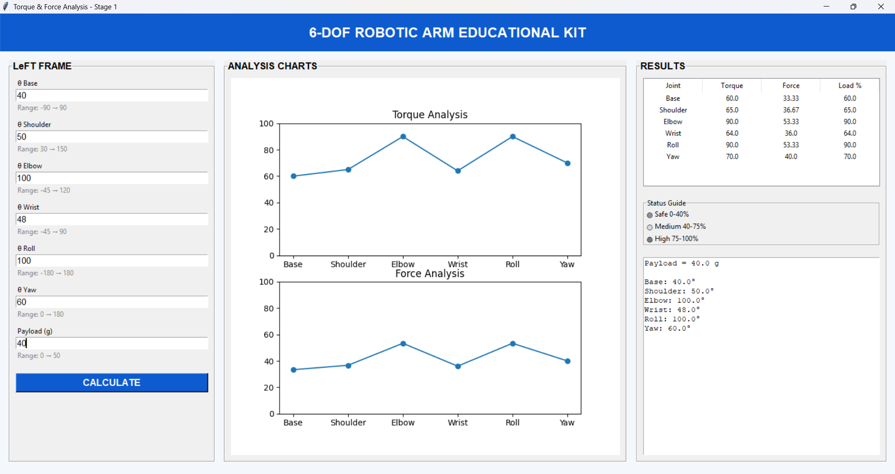 |

---

## 🤖 Robot Simulation

| Simulation View | End-Effector Motion |
|:---------------:|:-------------------:|
|  |  |

---

## 🔧 Robot Control

| Control Panel | Real-Time Operation |
|:-------------:|:-------------------:|
|  |  |


# 🛠️ Technologies Used

- Python 3.11
- Tkinter GUI
- PyBullet Simulation
- NumPy
- Matplotlib
- C++
- ESP32
- Robotics Algorithms
- URDF Robot Modeling

---

# 👨‍🏫 Supervisor

<div align="center">


## Dr. Amro Shafik

Project Supervisor

</div>

---

# 👥 Development Team

<div align="center">

| | | | |
|:-:|:-:|:-:|:-:|
| <br><b>Bassant Salah Rashad</b><br>Software Team | <br><b>Shahd Ahmed Mahboub</b><br>Mechanical & Software Team | 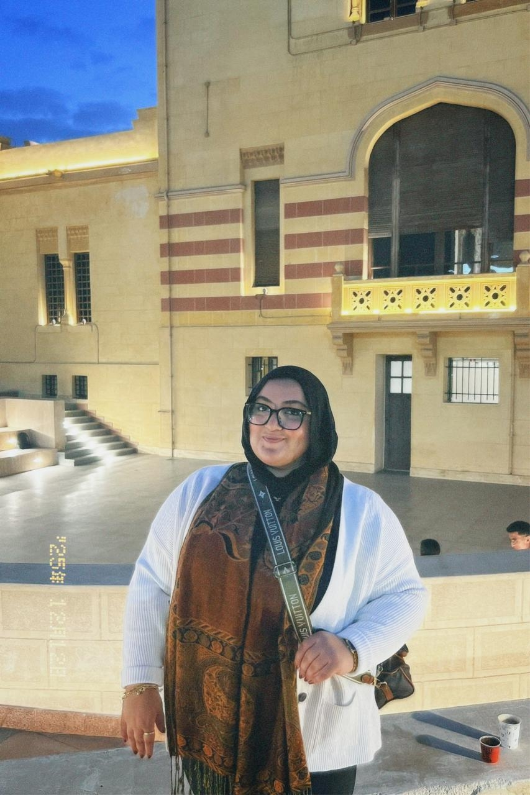<br><b>Haneen Ahmed Hamed</b><br>Software Team | <br><b>Fatema Ahmed Saad</b><br>Mechanical Team |
| <br><b>Seif Allah Wael Hassan</b><br>Software & Hardware Team | <br><b>Giovanni El-Amir Gaber</b><br>Hardware Team | <br><b>Mina Bahgat Bolus</b><br>Mechanical Team | 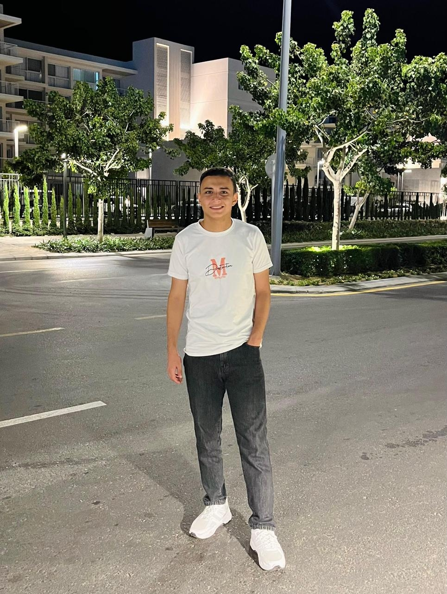<br><b>Mohamed Ahmed Ahmed</b><br>Mechanical Team |

</div>

---

# 🚀 Future Work

- ROS2 Integration
- AI-Based Motion Planning
- Computer Vision Integration
- Real Robot Deployment
- Web-Based Learning Platform
- Multi-Robot Simulation

---

# 📜 License

This project was developed as a Graduation Project at Benha National University for educational and research purposes.

---

<div align="center">

### ⭐ Thank you for visiting our project

Made with ❤️ by the Mechatronics and Automation Engineering Team

</div>

<div align="center">

⭐ If you like this project, don't forget to star the repository.

</div>
