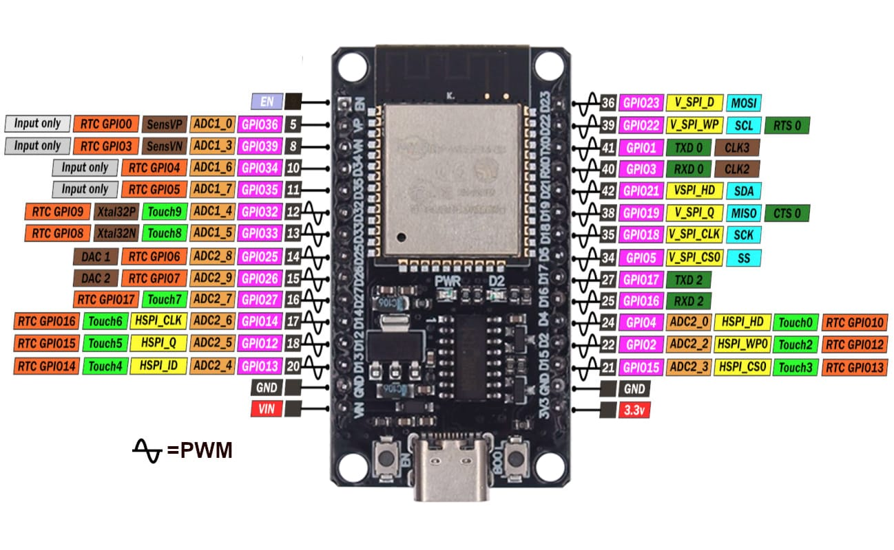

# 💻 Software Module

<div align="center">

# Software Development

### 6-DOF Educational Robotic Arm Kit

The software module provides an interactive educational platform that enables users to understand robotic kinematics through simulation, visualization, and real-time control.

</div>

---

# 📖 Overview

The software system was developed to bridge the gap between theoretical robotics concepts and practical implementation.

It combines mathematical modeling, graphical visualization, simulation, and hardware communication into one integrated educational platform.

The software allows users to:

- 🤖 Control the robotic arm
- 📐 Study Forward Kinematics
- 🎯 Solve Inverse Kinematics
- 📈 Generate robot trajectories
- 🖥️ Interact through a graphical interface
- 🌍 Visualize robot motion in real time
- 🔌 Communicate with the physical robot using ESP32

---

# 📂 Software Structure

```text
Software/
│
├── GUI/
├── Kinematics/
├── Simulation/
├── PyBullet/
├── ESP32/
└── Documentation/
```

---

# 🛠️ Technologies Used

| Technology | Purpose |
|------------|---------|
| Python | Main Programming Language |
| Tkinter | Graphical User Interface |
| PyBullet | Robot Simulation |
| NumPy | Mathematical Computation |
| Matplotlib | Data Visualization |
| C++ | ESP32 Programming |
| Serial Communication | Hardware Communication |

---

# 🖥️ GUI Module

The GUI provides an intuitive interface that allows users to interact with every module of the educational platform.

### Features

- Home Screen
- Forward Kinematics
- Inverse Kinematics
- Path Planning
- Robot Simulation
- Hardware Control
- Educational Visualization


---

# 📐 Kinematics Module

The Kinematics module implements the mathematical algorithms required for robotic motion.

### Includes

- Forward Kinematics
- Inverse Kinematics
- DH Parameters
- Transformation Matrices
- End-Effector Calculation


---

# 🤖 Simulation Module

Robot simulation is performed using PyBullet to visualize robot movement before executing commands on the physical robot.

### Features

- Real-Time Simulation
- Robot Animation
- Collision Visualization
- Motion Verification

---

# 🔌 ESP32 Communication

The software communicates with the physical robotic arm through ESP32.

### Responsibilities

- Serial Communication
- Sending Joint Angles
- Receiving Robot Status
- Synchronizing Simulation and Hardware



---

# 📚 Documentation

The Documentation folder contains:

- Source Code Documentation
- Installation Guide
- User Manual
- API Documentation

---

# 👨‍💻 Software Team

| Member | Responsibility |
|---------|----------------|
| **Bassant Salah Rashad** | Software Development |
| **Shahd Ahmed Mahboub** | Mechanical & Software |
| **Haneen Ahmed Hamed** | Software Development |
| **Seif Allah Wael Hassan** | Software & Hardware |

---

<div align="center">

### 💻 Software Developed for the 6-DOF Educational Robotic Arm Kit

</div>
